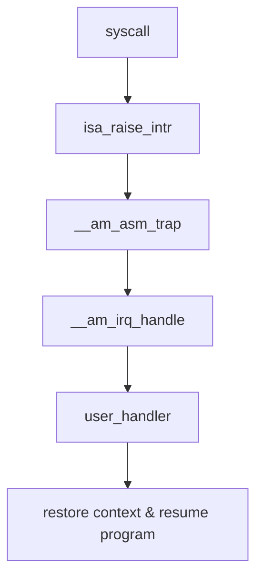


If someone is reading this blog, please be aware that the writer **DID NOT** consider the experience of the other readers.
After all, the most important thing is about writing things down for better memorization.


## Exception Handling/Interruption

- riscv32 uses instruction `ecall` for self-trapping. Once the cpu recieved an `ecall` instruction, it would then store the current address pointed by `pc` to CSR `mepc` and push its status(context) on to the stack, and jump to an exception handler function.

- This design is required because of privilege implementation. We want the application's behavior to be limited, and let the OS do the 'sensitive' works, like file read/write or memory allocation.

- See also :
    > riscv-privileged-20211203.pdf - page.37

### CSR: Control and Status Register

> **DeepSeek**: CSRs are special registers in RISC-V processors used to control and monitor the CPU's operation. They manage system-level functions such as interrupts, exceptions, and processor modes.

- Basically, CSRs are registers which stores data related to the control and status of the CPU.

---

- In PA3, we would implement four CSRs for riscv32-nemu, which are:

    - `mepc` -- **Machine Exception Program Counter**: Stores the address of the instruction where execution should resume after handling an exception or interrupt.
    - `mcause` -- **Machine Cause Register**: Indicates the reason for an exception or interrupt.
    - `mstatus` -- **Machine Status Register**: Tracks the processor's current state, including interrupt enable bits and processor mode.
    - `mtvec` -- **Machine Trap Vector Base Address Register**: Holds the base address for the exception/interruption handler.

- As we do not care about priviledge mode in PA, `mstatus` does not require much attention.
- Also, `mtvec` is set to 'direct mode', which means that all exceptions jump to the same address, which is function `__am_asm_trap` which we set its address into `mtvec` in `Trap.S`(See down below).

### `Trap.S`

- The error handler function is registerred to CSR `mtvec` when initializing cte module:

    ```c
    bool cte_init(Context *(*handler)(Event, Context *)) {
        // initialize exception entry
        asm volatile("csrw mtvec, %0" : : "r"(__am_asm_trap));

        // register event handler
        user_handler = handler;

        return true;
    }
    ```

- In this code snippet, function `__am_asm_trap` is defined in a file named `Trap.S`. The reason why it's written in assemble is that it is a architecture specific script, which means that the way the emulated cpu stores and restores context varies, and that requires completely differenct implementation.

- Content in `Trap.S`:

    ```asm
    .align 3
    .globl __am_asm_trap
    __am_asm_trap:
    addi sp, sp, -CONTEXT_SIZE

    MAP(REGS, PUSH)

    csrr t0, mcause
    csrr t1, mstatus
    csrr t2, mepc

    STORE t0, OFFSET_CAUSE(sp)
    STORE t1, OFFSET_STATUS(sp)
    STORE t2, OFFSET_EPC(sp)

    # set mstatus.MPRV to pass difftest
    li a0, (1 << 17)
    or t1, t1, a0
    csrw mstatus, t1

    mv a0, sp
    jal __am_irq_handle

    LOAD t1, OFFSET_STATUS(sp)
    LOAD t2, OFFSET_EPC(sp)
    csrw mstatus, t1
    csrw mepc, t2

    MAP(REGS, POP)

    addi sp, sp, CONTEXT_SIZE
    mret
    ```

- Reading this script really cost me a lot of time, mainly due to its frequent usage of macros.
- The main behavior of this script is:

    - First store all of the data in the registers on stack
    - Set CSR registers(`mcause`, `mstatus`, `mepc`)
    - Jump to interruption handling function `__am_irq_handle`
    - After the handler function returns, restore the registers using the data previously stored on stack

### System Call

- When the application need something to be done by the OS, it would invoke a 'system call', which is based on the exception handling/interruption mechanism mentioned above.
- See `syscall.c` in navy-apps:

    ```c
    intptr_t _syscall_(intptr_t type, intptr_t a0, intptr_t a1, intptr_t a2) {
    register intptr_t _gpr1 asm("a7") = type;
    register intptr_t _gpr2 asm("a0") = a0;
    register intptr_t _gpr3 asm("a1") = a1;
    register intptr_t _gpr4 asm("a2") = a2;
    register intptr_t ret asm("a0");
    asm volatile("ecall"
                : "=r"(ret)
                : "r"(_gpr1), "r"(_gpr2), "r"(_gpr3), "r"(_gpr4));
    return ret;

    }
    ```

    _(All macros are expanded)_

    - Here we can see that a system call is basically executing the `ecall` instruction plus passing some related data to certain registers, in order to tell the OS what the application requires it to do.

    - The registers taken by riscv32 in an exception handling process are `a7`, `a0`, `a1` and `a2`.(Specifically, `a7` register for storing system call type) After the system call is done, the return value is passed to the OS through register `a0`, and then returned to the user program.

### The Entire Process of a System Call

- User program invokes a system call, which is by executing assemble instruction `ecall`.
- NEMU interpret `ecall` and call function `isa_raise_intr`
- `isa_raise_intr` set `mepc`, `mcause` and returns address of the handler function, which is `am_irq_handle`, NEMU then jump to it.
- `am_irq_handle` create an `Event` object with the exception NO stored in register `a7` and pass it to `user_handler`(if there is one).
- After the user handler function returns, the `Context` object will be returned in order to restore the context.
- User program resumes.



## Multi-elf Support for Ftrace

### Implementation

- Since we already have a single-elf ftrace working, change the variable holding the file path into a linked list would solve the problem.

### `_start` issue

- There's a function called `_start` in a linking script called `start.S`, located in `/libs/libos/src/crt0/start.S`. It is not labeled as a function and its size is defaulted to 0.
- Therefore, ftrace is unable to locate this function, as well as the `address range` of it.

    ```c
    for (size_t i = 0; i < func_table.size; i++) {
        FuncSym curr_func = func_table.funcs[i];
        if (addr >= curr_func.value &&
            addr < curr_func.value + curr_func.size) {
            return curr_func;
        }
    }
    ```

- From the code in `ftrace` we can see that, the jump address must fall into the range of `[value, value + size)`. While the size of `_start` is defaulted to 0, ftrace can not find the corresponding symbol when the program invokes `_start`.

## `5000 Bytes == 8.0K` ?

- When I was checking the size of the file being taken into `fsimg`, I found a strange thing that:

    ```bash
    $ du -h fsimg/share/files/num
    8.0K    fsimg/share/files/num

    $ du --bytes fsimg/share/files/num
    5000    fsimg/share/files/num
    ```

    - `du -h` shows a `8.0K` file
    - `du --bytes` shows a 5000-byte file

- The reason is that, **5000 bytes** is the actual content size of the file, while **8.0K** is the disk usage of it.
- Filesystems allocate space in fixed-size blocks, often 4096 bytes(4K) each. A 5000-byte file needs two blocks _(2 x 4096 = 8192 bytes)_, rounded to 8.0K.

## `sbrk` Implementation

- `man sbrk`:

    > `brk()` and `sbrk()` change the location of the program break, which defines the end of the process's data segment (i.e., the program break is the first location after the end of the uninitialized data segment _(.bss)_ ).
    > Increasing the program break has the effect of allocating memory to the process; decreasing the break deallocates memory.
    > ...
    > `sbrk()` increments the program's data space by _increment_ bytes. Calling `sbrk()` with an _increment_ of 0 can be used to find the current location of the program break.

- We will need a symbol `end` to get the initial memory address of _program break_.

- `man end`:

    > **end**: This is the first address past the end of the uninitialized data segment (also known as the BSS segment)

    - We can get the address this way:

        ```c
        #include <stdio.h>
        #include <stdlib.h>

        extern char end; /* The symbol must have some type,
                            or "gcc -Wall" complains */

        int main(void) {
            printf("First address past:\n");
            printf("    uninitialized data (end)  %10p\n", &end);

            exit(EXIT_SUCCESS);
        }
        ```

---

- When `sbrk` is invoked by lib functions, it would invoke a system call called `SYS_brk`, which is basically requesting the OS for `increment` bytes of memory section.
- As nanos-lite is now only a single-program OS, all of the free memory is allocatable to the program, so the system call handler in nanos-lite for `SYS_brk` would just return 0 for now.

- As for `syscall.c` in navy-apps, `_sbrk` need to maintain the program break. Specifically, it is required to update pbreak at each time it is invoked, and return the pointer to the old program break.

## File System

- File system in nanos-lite is a simplified version of real-world fs. Specifically:

    - The size of each file is fixed
    - Data written into the file is not allowed to exceed its initial limit
    - The number of files is fixed, meaning that we can not create new files
    - There's no directoy

- These design makes the implementation of file system for nanos-lite much more simpler and easier.

---

- The abstraction of the files is an array whicn contains all of the files stored in `fsimg`. _(file names contains the path)_
- The way to achieve this is through a script written in `Makefile` along with some preset files such as `stdin` & `stdout`.

- The file list array is defined in `fs.c`:

    ```c
    typedef struct {
        char *name;
        size_t size;
        size_t disk_offset;
        ReadFn read;
        WriteFn write;
    } Finfo;

    /* This is the information about all files in disk. */
    static Finfo file_table[] __attribute__((used)) = {
        [FD_STDIN] = {"stdin", -1, 0, invalid_read, invalid_write},
        [FD_STDOUT] = {"stdout", -1, 0, invalid_read, serial_write},
        [FD_STDERR] = {"stderr", -1, 0, invalid_read, serial_write},
    #include "files.h"
    };
    ```

    - `files.h` is generated by navy-apps's Makefile:

        ```Makefile
        $(RAMDISK): fsimg
            $(eval FSIMG_FILES := $(shell find -L ./fsimg -type f))
            @mkdir -p $(@D)
            @cat $(FSIMG_FILES) > $@
            @truncate -s \%512 $@
            @echo "// file path, file size, offset in disk" > $(RAMDISK_H)
            @wc -c $(FSIMG_FILES)
                | grep -v 'total$$'
                | sed -e 's+ ./fsimg+ +'
                | awk -v sum=0 '{print "\x7b\x22" $$2 "\x22\x2c " $$1 "\x2c " sum "\x7d\x2c";sum += $$1}' >> $(RAMDISK_H)
        ```

- The last two element of `Finfo` is the 'read' and 'write' function for that specific file.

---

- Noted that, we treat `stdin`, `stdout` and `stderr` as files. This is what the statement 'Everything is a file' in Linux means: **the system components -- including hardware devices, directories, and processes -- are represented as files in the filesystem.**
- This design simplifies interaction with system resources because they can be accessed, read, and written using standard file operations (e.g., `open`, `read`, `write`).

- With a function pointer set to each file's struct object, we would only need to call it in `fs_read` & `fs_write`.

## Compound Literal Issue

- When I was implementing some SDL apis, I encounterred yet another subtle coding issue: defining and retreating the pointer of a compound literal struct object.

- Here's the initial code:

    ```c
    if (srcrect == NULL)
        srcrect = &((SDL_Rect){.x = 0, .y = 0, .w = src->w, .h = src->h});
    ```

- Turns out that `(SDL_Rect){...}` creates a temporary SDL_Rect object **inside the if block**. After the if statement ends, the temporary object disappears (goes out of scope).
- As a result, `srcrect` now holds a dangling pointer (an invalid memory address). Undefined behavior occurs when you try to use srcrect.

---

- To fix this, we would need a persistent object:

    ```c
    SDL_Rect full_src = {.x = 0, .y = 0, .w = src->w, .h = src->h};

    if (!srcrect) srcrect = &full_src;
    ```

- This way, `full_src` is defined in the function's scope, so it will live until the function returns.

## Pixel Value Conversion: Palette

- In PAL, the value of each pixel is 8-bit in length, and is not representing the color of that pixel. Instead, it is an index to a palette. We would need to convert that index to a 32-bit color value when rendering the rectangle.

- One thing worth mentioning is that, `SDL_Color->val` is not the target color value. The format of it does not match `AARRGGBB`, so we'll have to manually set the bit of the pixel data:

    ```c
    for (int i = 0; i < h; i++) {
        for (int j = 0; j < w; j++) {
            uint8_t idx = read_ptr[j];
            buf[i * w + j] = (colors[idx].a << 24) | (colors[idx].r << 16) |
                                (colors[idx].g << 8) | (colors[idx].b);
        }
        read_ptr += s->pitch;
    }
    ```

## To Be Continued...
