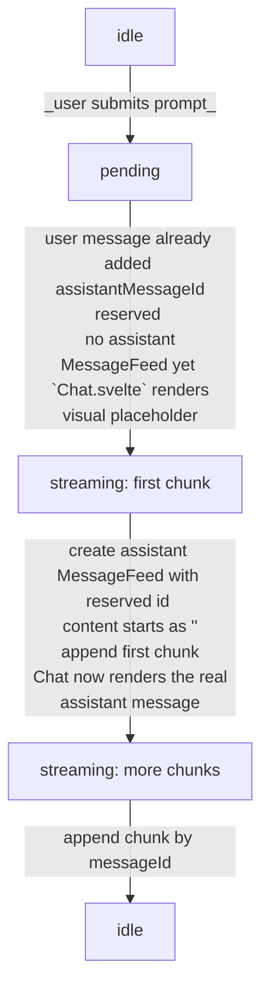

# textarea 自动伸缩

- 一个简单的需求：我们希望当用户输入的提示词长度过大时，textarea 的高度能随之伸展，将所有提示词内容显示出来。

- 相关代码：

    ```ts
    function adjustUI() {
        if (!textareaRef) {
            logger.error(" textareaRef is undefined, unable to reset textarea height. ");
            return;
        }
        textareaRef.style.height = "auto";
        textareaRef.style.height = `${textareaRef.scrollHeight <= 500 ? textareaRef.scrollHeight : 500}px`;
    }
    ```

    - 其中，`textareaRef` 是通过 `bind` 和 textarea element 绑定在一起的：

        ```ts
        <textarea
            bind:this={textareaRef}
            oninput={adjustUI}
            // ...
        ></textarea>
        ```

- 同时，在用户提交输入之后需要将输入框复原：

    ```ts
    textareaRef.style.height = "auto";
    ```

# LLM 回复状态层

- 期初的问题是：如何在用户发送消息之后在 UI 上渲染一个 Skeleton 消息来向用户表示“正在请求回复”。

- 一开始我是直接在消息数组中插入一个假消息作为 placeholder：

    ```ts
    {
        id: messageId,
        role: "assistant",
        timestamp: getCurrentTimestamp(),
        content: "Fetching response..."
    }
    ```

- 然后在 `Chat.svelte` 中判断 `messages` 的最后一条消息 `content` 是否为 "Fetching response..."，如果是，那么就将他渲染为 Placeholder 组件。

- 很显然，这是个非常丑陋的方案。我在与 ChatGPT 探讨一番后定下了一个设计：

    ```ts
    export type LLMResponseState = {
        messageId: string;
        phase: "idle" | "pending" | "streaming" | "error";
        error: string;
    };
    ```

- 在父组件 `App.svelte` 中定义一个新的 state 来追踪当前 LLM 的回复状态。这样一来，不只是等待回复中的 UI 提示便于设计，整个插件应用在用户的使用周期中的行为顺序设定也有了一个“抓手”。







- 此外，`callLLM` 函数中接受一个 `callback` 对象：

    ```ts
    export type LLMCallback = {
        onStream: (chunk: string) => void;
        onDone: () => void;
        onError: (error: string) => void;
    };
    ```

    1. `onStream` 负责将流式传输获取的 `chunk` 填入当前接收 LLM 消息输出的 `MessageFeed`，再籍由 Svelte 5 提供的深度状态机制自动触发 UI 更新
    2. `onDone` 负责在每条消息传输完成之后将对话内容持久化，即存储到 localStorage
    3. `onError` 负责触发 error 信息。（ _目前还未实现错误处理的 UI_ ）

- 这样一来，一次请求的周期，以及各自的状态变更和相对应的流程就非常明确了。

# 对话内容的持久化存储

- wxt 提供了一个 `storage` 模块，可以操作浏览器插件的 `browser.storage.local`：

    ```ts
    import { storage } from "wxt/utils/storage";
    ```

- 目前插件对于用户创建对话的处理流程是：

    ```mermaid
    flowchart TD
    A[no conversation] --->|user input| B[add user prompt \n **store conversation**]
    B --->|stream llm message| C[stream llm message chunks into messageFeed \n **store conversation**]
    ```

- 可以看到，存储对话信息的时间在 **用户消息发送之后** ，以及 **LLM 消息传输完成之后** 。这意味着如果用户在流式传输的过程中关闭插件侧板，将会导致流式传输中断，并且不会触发保存机制。

- 目前来说，这是预期内行为，因为我感觉将 API 请求和流式传输搬到 `background.ts` 实在是有些笨重。或许将来会考虑这样做。

---

- 值得一提的是，浏览器插件的 storage 毕竟不是数据库，并不支持 _根据 `sessionId` 来存取对应的 `Conversation`_ 这种行为，因此笔者决定采用 Key Prefixing 的方式——直接将 `sessionId` 当作 `key` 存在 Storage 中：

    ```ts
    export function getConversationKey(sessionId: UUID): `local:${string}` {
        return `local:conversation:${sessionId}`;
    }
    ```

- 这样一来就可以在某种程度上实现 _根据 `sessionId` 来存取对应的 `Conversation`_ 的行为。

# Streaming 消息的流式传输

- 流式传输——这是一个 LLM 应用前端的“典中典”功能，其在 `OpenAI` 官方提供的第三方库的帮助下，实现意外的简单。

- `callback` 函数中的 `onStream` 如下所示：

    ```ts
    /**
     * @param messageId the target message feed reserved for LLM response
     * @param chunk new arrived chunk ready for streaming
     *
     * @description update message with id `messageId` in `messageFeed` by adding `chunk` to its content
     */
    function streamMessage(messageId: UUID, chunk: string) {
        const index = conversation?.messages.findIndex((m) => m.id === messageId);

        if (index === -1) {
            logger.error("target messageId does not exist: ", messageId);
            return;
        }

        llmResponse.phase = "streaming";
        // NOTE: requires svelte 5 deep state
        conversation.messages[index].content += chunk;
    }
    ```

- 至于 `callLLM` 中的流式传输逻辑：

    ```ts
    // LLM API integration
    try {
        const stream = await client.chat.completions.create({
            model: params.modelName,
            messages: completeContext,
            stream: true
        });

        // update message with LLM stream response
        for await (const chunk of stream) {
            const chunkContent = chunk.choices[0]?.delta?.content || "";
            if (chunkContent) params.callback.onStream(chunkContent);
        }

        params.callback.onDone();
    } catch (error) {
        params.callback.onError(String(error));
        throw error;
    }
    ```

    _`client` 是一个 `OpenAI` 对象_

- 我还真是第一次在 js/ts 中遇到这种“异步循环” `for await`，看了一下 [MDN](https://developer.mozilla.org/en-US/docs/Web/JavaScript/Reference/Statements/for-await...of)：

    > The for `await...of` statement creates a loop iterating over async iterable objects as well as sync iterables. This statement can only be used in contexts where `await` can be used, which includes inside an async function body and in a module.

- 倘若如此的话，`stream` 应该是一个 _async iterable object_ ？查看其类型，发现是 `Stream<ChatCompletionChunk> & { _request_id?: string | null | undefined }`。

- 翻看 [OpenAI 文档](https://developers.openai.com/api/reference/resources/completions/methods/create) 得知参数 `stream` ：

    > stream: optional boolean
    > Whether to stream back partial progress. If set, tokens will be sent as data-only [server-sent events](https://developer.mozilla.org/en-US/docs/Web/API/Server-sent_events/Using_server-sent_events#Event_stream_format) as they become available, with the stream terminated by a `data: [DONE]` message.

- 所以简而言之，`client.chat.completions.create` 中将 `stream` 参数设置为 `true` 即可让其返回在 resolve 后返回一个特殊的 `iterable object` (`Stream<ChatCompletionChunk>`) 的 `APIPromise`；对这个特殊的可迭代对象使用 `for-await` 循环即可渐进的取得流式传输的输出。



- 瞅了一眼 `openai` 库源码，发现 `Stream` 实例对象确实具有一个 `iterator` 属性：

    ```ts
    export class Stream<Item> implements AsyncIterable<Item> {
    controller: AbortController;
    #client: OpenAI | undefined;

    constructor(
        private iterator: () => AsyncIterator<Item>,
        controller: AbortController,
        client?: OpenAI,
    ) {
        this.controller = controller;
        this.#client = client;
    }
    ```

- 再看一眼 `client.chat.completions.create` 方法的源码：

    ```ts
    export class Completions extends APIResource {
    messages: MessagesAPI.Messages = new MessagesAPI.Messages(this._client);

    /**
    * Creates a model response for the given chat conversation. Learn more in the
    * [text generation](https://platform.openai.com/docs/guides/text-generation),
    * [vision](https://platform.openai.com/docs/guides/vision), and
    * [audio](https://platform.openai.com/docs/guides/audio) guides.
    *
    * Returns a chat completion object, or a streamed sequence of chat completion
    * chunk objects if the request is streamed.
    */
    create(body: ChatCompletionCreateParamsNonStreaming, options?: RequestOptions): APIPromise<ChatCompletion>;
    create(
        body: ChatCompletionCreateParamsStreaming,
        options?: RequestOptions,
    ): APIPromise<Stream<ChatCompletionChunk>>;
    create(
        body: ChatCompletionCreateParamsBase,
        options?: RequestOptions,
    ): APIPromise<Stream<ChatCompletionChunk> | ChatCompletion>;
    create(
        body: ChatCompletionCreateParams,
        options?: RequestOptions,
    ): APIPromise<ChatCompletion> | APIPromise<Stream<ChatCompletionChunk>> {
        return this._client.post('/chat/completions', { body, ...options, stream: body.stream ?? false }) as
        | APIPromise<ChatCompletion>
        | APIPromise<Stream<ChatCompletionChunk>>;
    }
    ```

    ```ts
    export interface ChatCompletionCreateParamsStreaming extends ChatCompletionCreateParamsBase {
        /**
         * If set to true, the model response data will be streamed to the client as it is
         * generated using
         * [server-sent events](https://developer.mozilla.org/en-US/docs/Web/API/Server-sent_events/Using_server-sent_events#Event_stream_format).
         * See the
         * [Streaming section below](https://platform.openai.com/docs/api-reference/chat/streaming)
         * for more information, along with the
         * [streaming responses](https://platform.openai.com/docs/guides/streaming-responses)
         * guide for more information on how to handle the streaming events.
         */
        stream: true;
    }
    ```

- 观察函数重载的签名得知，`stream` 项设置为 `true` 的时候，`chat.completions.create` 将返回一个 `APIPromise<Stream<ChatCompletionChunk>>`。

- 这个 OpenAI 自定义的 Promise 重写了`then` 函数：

    ```ts
    private parse(): Promise<WithRequestID<T>> {
        if (!this.parsedPromise) {
            this.parsedPromise = this.responsePromise.then((data) =>
                this.parseResponse(this.#client, data),
            ) as any as Promise<WithRequestID<T>>;
        }
        return this.parsedPromise;
    }

    override then<TResult1 = WithRequestID<T>, TResult2 = never>(
        onfulfilled?: ((value: WithRequestID<T>) => TResult1 | PromiseLike<TResult1>) | undefined | null,
        onrejected?: ((reason: any) => TResult2 | PromiseLike<TResult2>) | undefined | null,
    ): Promise<TResult1 | TResult2> {
        return this.parse().then(onfulfilled, onrejected);
    }
    ```

- 那么这个 `this.parseReponse` 函数是哪里传过来的呢？根据此前 `create` 的源码我们知道其调用了 `this._client.post(...)`，具体来说：

    ```ts

    /**
    * API Client for interfacing with the OpenAI API.
    */
    export class OpenAI {
        apiKey: string;
        organization: string | null;
        project: string | null;
        // ...

        post<Rsp>(path: string, opts?: PromiseOrValue<RequestOptions>): APIPromise<Rsp> {
            return this.methodRequest('post', path, opts);
        }

        private methodRequest<Rsp>(
            method: HTTPMethod,
            path: string,
            opts?: PromiseOrValue<RequestOptions>,
        ): APIPromise<Rsp> {
            return this.request(
                Promise.resolve(opts).then((opts) => {
                    return { method, path, ...opts };
                }),
            );
        }

        request<Rsp>(
            options: PromiseOrValue<FinalRequestOptions>,
            remainingRetries: number | null = null,
        ): APIPromise<Rsp> {
            return new APIPromise(this, this.makeRequest(options, remainingRetries, undefined));
        }
    ```

- 再观察 `APIPromise` 类的构造函数：

    ```ts
    export class APIPromise<T> extends Promise<WithRequestID<T>> {
    private parsedPromise: Promise<WithRequestID<T>> | undefined;
    #client: OpenAI;
        constructor(
            client: OpenAI,
            private responsePromise: Promise<APIResponseProps>,
            private parseResponse: (
                client: OpenAI,
                props: APIResponseProps,
            ) => PromiseOrValue<WithRequestID<T>> = defaultParseResponse,
        ) {
            super((resolve) => {
                // this is maybe a bit weird but this has to be a no-op to not implicitly
                // parse the response body; instead .then, .catch, .finally are overridden
                // to parse the response
                resolve(null as any);
            });
            this.#client = client;
        }
    ```

- 可以看到，`create` 函数调用之后的 `request` 函数中返回一个新的 `APIPromise` 对象的时候，没有传入 `parseResponse` 函数，因此其被定义为 `defaultParseResponse`：

    ```ts
    export async function defaultParseResponse<T>(
        client: OpenAI,
        props: APIResponseProps,
    ): Promise<WithRequestID<T>> {
        const { response, requestLogID, retryOfRequestLogID, startTime } = props;
        const body = await (async () => {
            if (props.options.stream) {
                // ...

                return Stream.fromSSEResponse(
                    response,
                    props.controller,
                    client,
                    props.options.__synthesizeEventData,
                ) as any;
            }
    ```

- 这里，当 `props.options.stream` 设为 true 的时候，返回的是 `Stream.fromSSEResponse` 函数的返回值，具体来说：

    ```ts
    class Stream {
        constructor(iterator, controller, client) {
            this.iterator = iterator;
            // ...
        }
        static fromSSEResponse(response, controller, client, synthesizeEventData) {
            let consumed = false;
            const logger = client ? (0, log_1.loggerFor)(client) : console;
            async function* iterator() {
                // iterator implementation
            }
            return new Stream(iterator, controller, client);
        }
    ```

- 可以看到，这就是最开始我们所寻找的 iterator。（ _具体的 iterator 实现内部过于复杂，懒得看_ ）

---

- 既然已经读完了（部分）源码，是时候问出那个问题了：~~Why so serious?~~ 为什么要搞的这么复杂？

- 说实话，面对这么一大段像意大利面一样（或许不至于）的源码，我是没什么头绪的。我明白知其然知其所以然的道理，但确实个人能力有限，没有开发过这种级别的，涉及 streaming 的库，难以理解为什么需要如此复杂的处理流程。

- 因此我询问了 ChatGPT，得到如下回复：

    > Yes — it is more complicated than a one-off app would need, but it is solving library-level problems.
    >
    > - One API must handle both normal JSON responses and streamed SSE responses.
    > - It must work in Node, browsers, edge runtimes, and React Native.
    > - It must preserve await client.chat.completions.create(...) ergonomics while still returning an async stream when requested.
    > - It must handle aborts, retries, parse errors, and request metadata consistently.
    > - It reuses the same streaming engine for chat, responses, assistants, and other endpoints.

    > The layering is intentional:
    >
    > - `APIPromise` delays parsing until the user actually awaits/then-chains.
    > - `defaultParseResponse()` decides whether the result is JSON or a Stream.
    > - `Stream.fromSSEResponse()` converts the fetch ReadableStream into SSE events.
    > - `ReadableStreamToAsyncIterable(...)` is just the adapter that makes browser/fetch streams usable with for await.

    > So the complexity is mostly an adapter stack:
    >
    > - HTTP response -> ReadableStream -> async iterable -> SSE frames -> parsed chunks -> user loop.

    > For a library, that’s useful because:
    >
    > - it keeps the public API small,
    > - it hides runtime differences,
    > - and it gives consistent cancellation/error behavior.

    > So: yes, the internal call graph is twisty, but it’s mostly “plumbing” to make streaming feel simple at the call site.

- 看起来，要求一个库在多种环境，面对多种输入和输出，以及存在异步资源请求的情况下工作并不是一件容易的事情。



- 说实话，感觉这种 [Stainless API](https://www.stainless.com/) 生成的 SDK 代码读起来好像并不是那么有价值。

# 题外话

- 说点题外话——我感觉开发/学习这个网页插件的方式和传统的方式大有不同。具体来说，我已经变的非常依赖 LLM 了。

- 尽管我自称所谓“轻度维新派”，坚持自己写代码，对于 LLM 生成的代码则每一行都自己审计并尝试理解，改正其错误或者根据 codebase 变化进行魔改。但不可否认的是，我对于许多开发过程中所需要的知识都是通过 LLM 获得的，我发现自己变的非常依赖 LLM 提供的 SOTA 技术选型/起步框架，辅助阅读源码的能力以及设计模式方面的建议。

- 倒也不是感到恐慌，能够普及的新技术自有其优势和用处，若是要依靠传统的教程 + 搜索引擎 + 论坛 + 官方技术文档的方式写插件，那怕是费老鼻子劲了。

- 但确实，这让我再次对于 LLM 介入开发的程度感觉到一种模糊的摇摆之感——在“古法编码”和“vibe coding”之间的平衡点，到底在哪里呢？

- 倘若将来这些大型科技公司因为“没有故事可讲”，“没有对得起估值的盈利方式”而无法再提供这样的 API 服务，又或者是让价格大幅上涨，限额进一步缩减，我还能以同等的效率学习/写出同等质量的代码吗？
